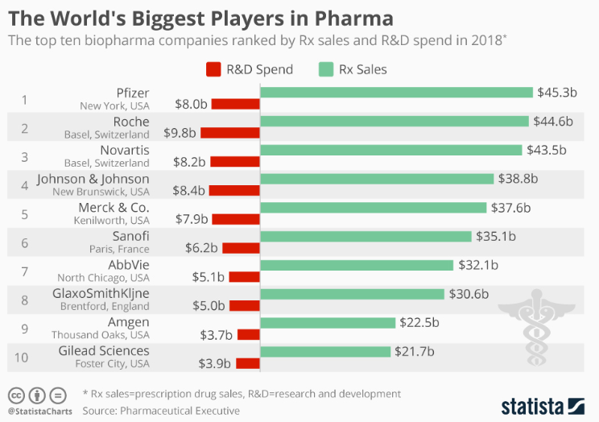
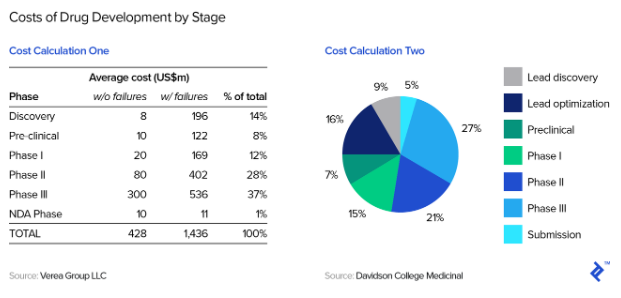

## Good Data Visualization

<!-- --> 

I selected the image above as an example of good data visualization. It
comes from an article discussing the annual ranking of the top 50
biopharma companies according to prescription drug sales in 2018. The
graph is attempting to show how much money is spent by pharmaceutical
companies on research and development commpared to the revenue they
generate from sales.

I think the use of a diverging bar chart best illustrates how small the
spending is on research and development compared to the sales generated.
There isn’t any clutter or unnecessary style added to it. It gets
straight to the point by simply displaying the money spent in R\&D in
red, and revenue generated from sales in green. Not only does it convey
the the message of which companies are the biggest influencers in
prescription drug sales, but it also shows how R\&D costs pale in
comparison to the revenue generated from sales.

## Bad Data Visualization

<!-- -->

I selected the image above as an example of bad data visualization. This
came from an article disucssing biotech pipeline valuation.
Specifically, the image above was used to express how drug development
is expensive. By laying out the statistics of each developmental stage,
the author wanted to evaluate the valuation of a biotech company in
relation to how much spending is involved in the developmental stages.

The pie chart on the right is what I thought did a poor job displaying
this message. There are 7 variables on the right that it attempts to
measure, which causes lots of back and forth viewing of the chart and
legend. I think the use of a simple bar graph would eliminate this, but
would also be useful in displaying the expenses of each developmental
stage in chronological order. The first variable would be ‘Lead
discovery’, leading all the way up to the last variable, which would be
‘Submission’. This would allow the viewer to read the bar graph left
to right, and see how expenses vary as you progress through the
different stages of drug development.
